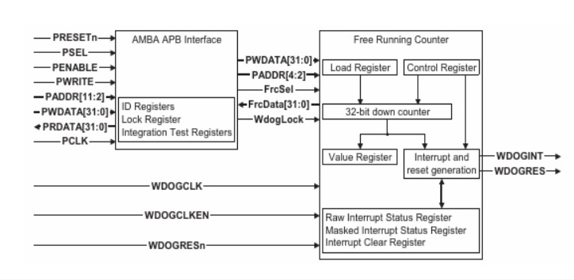
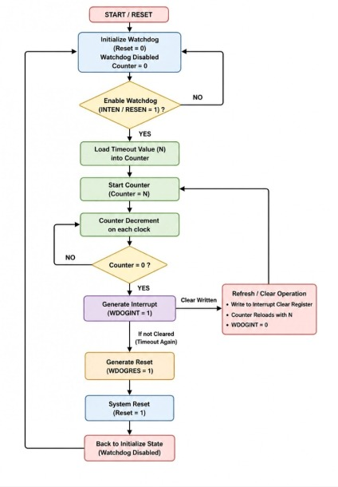
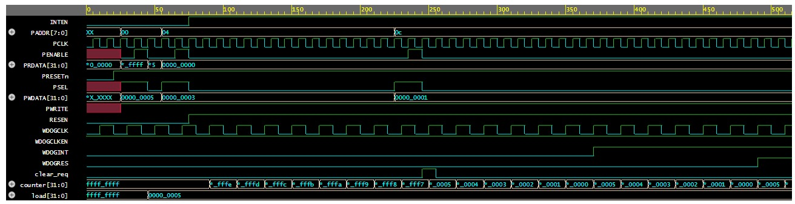

# ⏱️ APB-Based Watchdog Timer Design and Verification using SystemVerilog

## 📌 Overview

The APB-Based Watchdog Timer is a SystemVerilog RTL design and verification project developed for fault monitoring in embedded systems and System-on-Chip (SoC) architectures. The watchdog timer continuously monitors processor activity and detects abnormal conditions such as software hangs, infinite loops, and delayed responses.

The design is integrated with the AMBA Advanced Peripheral Bus (APB) protocol, enabling processor-controlled configuration through memory-mapped registers. A layered SystemVerilog verification environment is developed to validate functionality and ensure reliable operation.

---

## 🎯 Problem Statement

Modern embedded systems require reliable fault detection mechanisms to ensure continuous operation. Software failures such as processor hangs, deadlocks, and infinite loops can cause system malfunction and reduce reliability.

This project aims to design and verify a configurable APB-based Watchdog Timer capable of detecting processor inactivity and automatically initiating recovery actions through interrupt and reset generation.

---

## ✨ Features

### 🔗 APB Slave Interface

Supports communication with the processor using the AMBA APB protocol for register configuration and control.

### ⏲️ Configurable Timeout Value

Allows the processor to program different timeout values based on system requirements.

### 🔄 Watchdog Refresh Mechanism

The watchdog counter is periodically refreshed by the processor during normal operation.

### ⚠️ Interrupt Generation (WDOGINT)

Generates an interrupt signal when the first timeout event occurs, providing an early warning indication.

### 🔁 Reset Generation (WDOGRES)

Generates a system reset signal if the watchdog remains unrefreshed after the interrupt stage.

### 🧪 Layered Verification Environment

Implements a self-checking SystemVerilog testbench using generator, driver, monitor, reference model, and scoreboard components.

---

## 🛠️ Technologies Used

* SystemVerilog
* RTL Design
* Functional Verification
* AMBA APB Protocol
* Digital Design
* SoC Design Concepts
* EDA Playground

---

## 📚 Verification Components

### Generator

Creates APB transactions and watchdog test scenarios.

### Driver

Converts transactions into APB protocol signals and drives them to the DUT.

### Monitor

Observes DUT outputs and captures watchdog behavior.

### Reference Model

Predicts expected watchdog functionality.

### Scoreboard

Compares expected outputs with actual DUT outputs and reports PASS/FAIL status.

---

## ⚙️ Working Principle

1. Processor configures watchdog registers through the APB interface.
2. A timeout value is loaded into the watchdog counter.
3. The counter continuously decrements with every clock cycle.
4. The processor periodically refreshes the watchdog.
5. If refresh is received, the counter reloads and operation continues.
6. If refresh is absent, the watchdog generates an interrupt signal (WDOGINT).
7. If the watchdog remains unrefreshed, a reset signal (WDOGRES) is generated.
8. The system recovers and resumes normal operation.

---

## 📁 Project Structure

apb-watchdog-timer-systemverilog/

├── rtl/

│   └── wdt_apb.sv

├── tb/

│   ├── apb_if.sv

│   ├── wdt_if.sv

│   ├── transaction.sv

│   ├── generator.sv

│   ├── driver.sv

│   ├── monitor.sv

│   ├── reference_model.sv

│   ├── scoreboard.sv

│   ├── environment.sv

│   └── test.sv

├── docs/

│   ├── APB_Watchdog_Timer_block_diagram.jpeg

│   ├── APB_Watchdog_Timer_Flow_chart.jpeg

│   ├── analysis_waveform.jpeg

│   └── APB_Watchdog_Timer_IEEE_PAPER.pdf

├── README.md

└── LICENSE

---

## 📸 Results

### System Architecture

### Flowchart

### Simulation Waveform

Simulation results confirm:

* Correct APB communication
* Successful timeout detection
* Proper watchdog refresh operation
* Interrupt generation (WDOGINT)
* Reset generation (WDOGRES)

---

## ▶️ Simulation

### EDA Playground

https://www.edaplayground.com/x/V_nJ

---

## 🔮 Future Enhancements

* Window Watchdog Implementation
* FPGA-Based Hardware Validation
* UVM-Based Verification Environment
* Programmable Clock Divider Support
* Advanced Fault Monitoring Features

---

## 🎓 Academic Use

This project was developed as part of VLSI Design and Verification learning to understand APB communication, watchdog timer architecture, RTL design, and functional verification methodologies.

---

## 👩‍💻 Author

**V M Swathika**

Electronics and Communication Engineering (ECE)

RTL Design | SystemVerilog | Verification | SoC Design | VLSI

GitHub: https://github.com/swathika0401/apb-watchdog-timer-systemverilog

